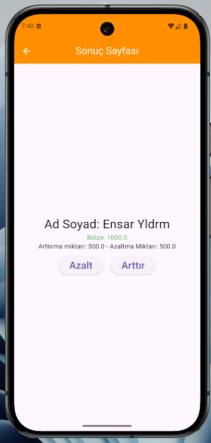

# Bütçe Yönetim Uygulaması (Flutter)

Kullanıcıların bütçelerini takip edebileceği, arttırma/azaltma işlemleri yapabileceği basit bir mobil uygulama.

| Giriş Sayfası | Sonuç Sayfası |
|--------------|--------------|
| [Ana Ekran](assets/screenshots/ana_sayfa.png) |   |

## 🌟 Özellikler
- Ad-soyad ve başlangıç bütçesi girişi
- Bütçe arttırma/azaltma işlemleri
- Dinamik renkli bütçe göstergesi (negatif/pozitif durum)
- Responsive tasarım (tüm cihazlarda uyumlu)
